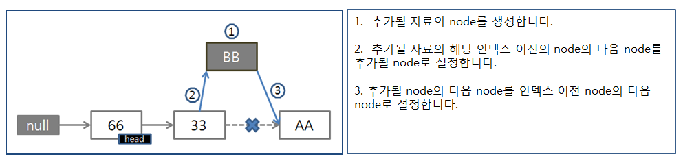
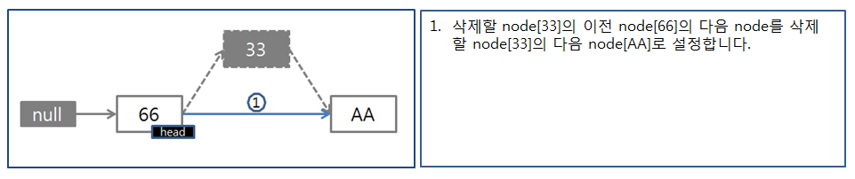

# List

1. __[ArrayList](./src/main/java/com/jaeyeonling/stl/list/MyArrayList.java)__
2. __[LinkedList](./src/main/java/com/jaeyeonling/stl/list/MyLinkedList.java)__

|                            | ArrayList | LinkedList                                              |
| -------------------------- | --------- | ------------------------------------------------------- |
| Indexing                   | Θ(1)      | Θ(n)                                                    |
| Insert/delete at beginning | Θ(n)      | Θ(1)                                                    |
| Insert/delete at end       | Θ(1)      | Θ(n)-last element is unknown Θ(1)-last element is known |
| Insert/delete in middle    | Θ(n)      | search time + Θ(1)                                      |
| Wasted space (average)     | Θ(n)      | Θ(n)                                                    |

---

### ArrayList

내부에 배열을 가지고 있는 구조로 구현돼 있다.

##### 장점

1. 무작위 접근이 가능하다.
2. LinkedList보다 빠르다.

##### 단점

1. 자료의 삽입이나 삭제시 O(N)의 시간이 필요하다.

1. 배열의 크기가 정해져있어 데이터가 많아질 경우 크기를 재조정 한다.

---

### LinkedList

내부에 노드를 가지고 다음 노드의 주소를 참조하고 있다.

##### 장점

1. 자료의 삽입이나 삭제를 위치에 상관없이 빠르게 수행을 할 수 있다.
2. 리스트 내에서 자료의 이동이 필요하지 않다.
3. 메모리 만큼의 자료를 삽입할 수 있다.

##### 단점

1. 순차접근만 가능하다.
2. 특정 자료의 탐색 시간이 많이 소요된다.

http://www.nextree.co.kr/p6506/